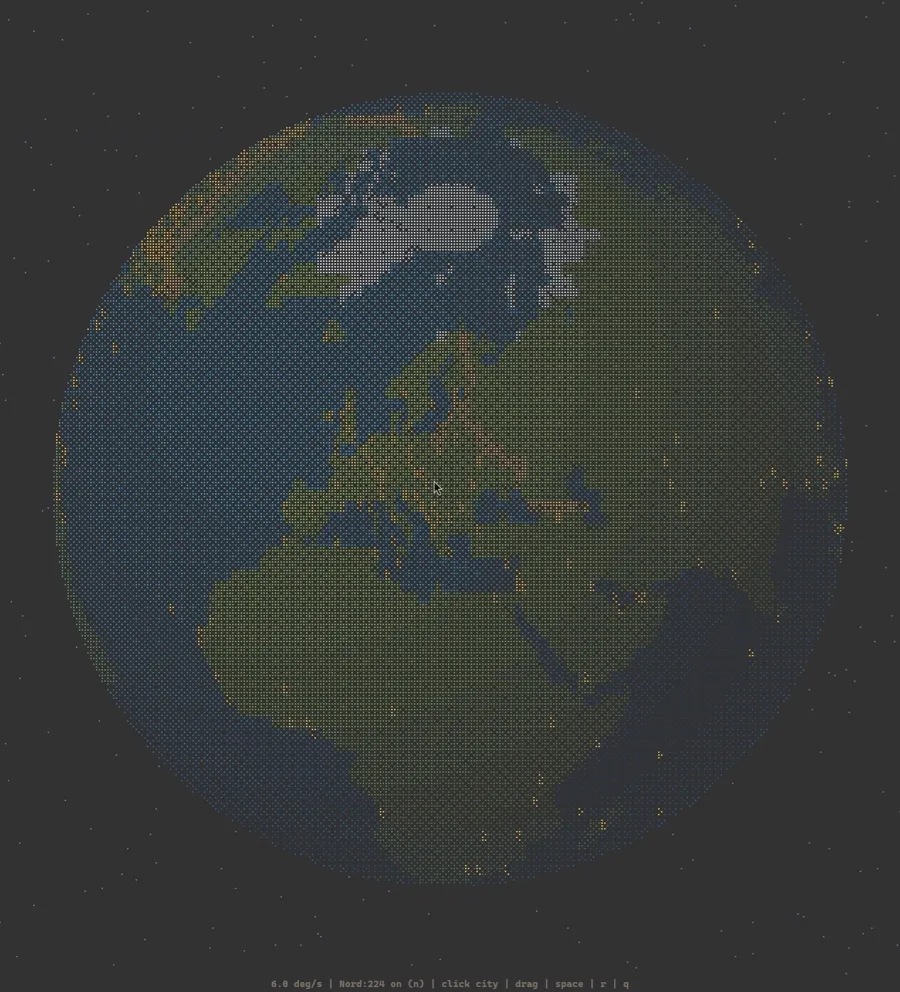

# Rotating Earth

[](./misc/recording-20260809-103552.mp4)

[Watch the MP4 demo](./misc/recording-20260809-103552.mp4)

An interactive terminal globe rendered with Unicode Braille characters. It
rotates automatically, responds to mouse dragging, and displays NordVPN server
cities over a static starfield.

## Features

- High-resolution 2x4 Braille subpixels
- Mouse hover, click, and drag controls
- 224 bundled NordVPN city markers
- Optional confirmed `nordvpn connect` actions
- Responsive terminal sizing and 24-bit color
- Parallel rendering with low-power paused mode
- No third-party Python dependencies

## Requirements

- Python 3.10+
- A UTF-8 Unix-like terminal with xterm SGR mouse support
- NordVPN CLI only if you want to connect from a city marker

## Run

```bash
python3 rotating_earth.py
```

## Controls

| Input | Action |
| --- | --- |
| Hover city | Highlight marker |
| Click city | Show its name |
| Click city name | Open connection confirmation |
| Left-drag | Rotate Earth |
| Arrow keys | Nudge rotation |
| Space | Pause or resume |
| `n` | Toggle city markers |
| `r` | Reset the view |
| `q` / Escape | Quit |

Confirm a NordVPN connection with `y` or Enter. Cancel with `n` or Escape.
No connection command runs without confirmation.

## Options

```text
--fps 18        Set frame rate (default: 24)
--speed 3       Set degrees per second (default: 6)
--workers 2     Set render worker processes
--no-color      Disable ANSI color
--no-cities     Start without city markers
```

Use `python3 rotating_earth.py --help` for all options.

## Tests

```bash
python3 -m unittest -v
```

## Data

Land and simplified boundary data come from the public-domain
[Natural Earth](https://www.naturalearthdata.com/) 1:110m datasets. NordVPN
city coordinates are a bundled snapshot of its public countries API.

This is an unofficial project and is not affiliated with NordVPN.
